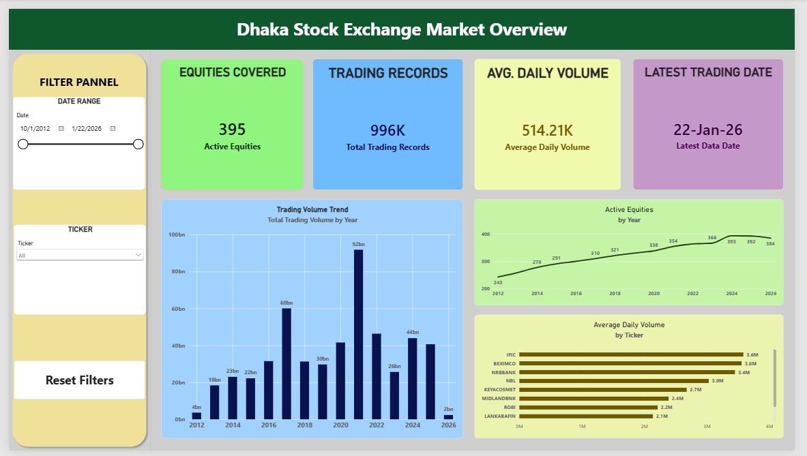

# Dhaka Stock Exchange Market Analysis

An end-to-end data analysis project exploring historical equity market activity on the **Dhaka Stock Exchange (DSE)** using **Python, Pandas, Matplotlib, and Power BI**.

The project focuses on data quality, historical market coverage, trading activity, price movements, returns, and volatility, followed by an interactive Power BI dashboard for market-level analysis.

---

## Dashboard Preview



> **Current Dashboard:** Page 1 – Dhaka Stock Exchange Market Overview  
> Page 2 – Equity Explorer is currently under development.

---

## Project Overview

The original dataset contains multiple financial instrument types, including equities, mutual funds, bonds, treasury bills, indices, and sukuk.

For this project, the analysis focuses specifically on **395 equity securities** to maintain meaningful comparisons across similar financial instruments.

The analysis workflow includes:

**Data Understanding → Data Quality Validation → Equity Filtering → Feature Engineering → Exploratory Data Analysis → Power BI Dashboard**

---

## Dataset

The dataset contains historical end-of-day financial data from the **Dhaka Stock Exchange**.

### Original Data Fields

- Date
- Ticker
- Open
- High
- Low
- Close
- Volume

### Dataset Coverage

- Historical period: **October 2012 – January 2026**
- Total instruments in source dataset: **486**
- Equity securities analyzed: **395**
- Processed equity observations: approximately **996K**

The source dataset also provides both adjusted and unadjusted historical data.

For this project:

- **Adjusted OHLC prices** are used for price and return analysis.
- **Unadjusted volume** is used for trading activity analysis.

### Dataset Source

[Mendeley Data – Dhaka Stock Exchange End-of-Day Financial Dataset](https://data.mendeley.com/datasets/23553sm4tn/4)

---

## Tools & Technologies

- **Python**
- **Pandas**
- **NumPy**
- **Matplotlib**
- **Google Colab**
- **Power BI**
- **DAX**
- **Git & GitHub**

---

## Data Preparation

The dataset was first inspected and validated before analysis.

### Data Quality Checks

The following checks were performed:

- Missing values
- Duplicate records
- Duplicate `Ticker + Date` observations
- Invalid or non-positive prices
- Negative and zero trading volume
- OHLC consistency
- Historical coverage differences
- Adjusted vs unadjusted record coverage

A major analytical consideration was that different equities have different historical observation periods.

Therefore, securities were not assumed to have identical historical coverage.

---

## Feature Engineering

Several analytical features were created from the original OHLCV data:

### Daily Return

Measures the percentage change in closing price from the previous trading observation.

### Price Change

Difference between daily closing and opening prices.

### Price Change %

Percentage movement between Open and Close.

### Trading Range

Difference between daily High and Low.

### Trading Range %

Measures intraday price range relative to the opening price.

### 7-Day Moving Average

Short-term moving average of adjusted closing prices.

### 30-Day Moving Average

Longer-term moving average used to identify price trends.

### 30-Day Rolling Volatility

Rolling standard deviation of daily returns used to measure historical return variability.

### Volume Change %

Percentage change in trading volume compared with the previous observation.

### Cumulative Price Return

Compounded historical price return calculated from daily returns.

---

## Exploratory Data Analysis

The Python analysis covers several areas of the DSE equity market.

### 1. Market Coverage Analysis

Analyzed:

- Active equities by year
- Historical coverage by ticker
- First and last available dates
- Number of trading observations by security

This helped identify differences in data availability across securities.

### 2. Trading Activity Analysis

Evaluated equities using:

- Total trading volume
- Average daily volume
- Median daily volume
- Trading days

Average daily volume was used alongside total volume because securities with longer historical coverage naturally accumulate larger total trading volumes.

### 3. Price Trend Analysis

Analyzed:

- Adjusted closing prices
- Normalized price trends
- 7-day moving averages
- 30-day moving averages

### 4. Return Analysis

Examined:

- Average daily return
- Median daily return
- Return distribution
- Positive and negative trading days
- Cumulative price return

### 5. Volatility Analysis

Used rolling volatility to evaluate historical differences in return variability across equities and over time.

### 6. Volume vs Price Movement

Explored the historical association between:

- Trading Volume
- Absolute Daily Return

Correlation was treated only as a measure of association and not as evidence of causation.

### 7. Common-Window Comparison

Selected equities were compared over the same historical date window to reduce bias caused by different listing dates and observation periods.

---

## Power BI Dashboard

### Page 1 – Dhaka Stock Exchange Market Overview

The current dashboard provides a high-level overview of DSE equity market activity.

### KPI Cards

- **Equities Covered**
- **Trading Records**
- **Avg. Daily Volume**
- **Latest Trading Date**

### Visualizations

- Trading Volume Trend
- Equity Coverage Over Time
- Top 10 Equities by Average Daily Volume

### Interactive Filters

- Date Range
- Ticker Selection
- Reset Filters

The dashboard allows users to explore historical market activity dynamically across different periods and securities.

---

## Dashboard Development Roadmap

### Completed

- Data understanding
- Data quality validation
- Equity filtering
- Feature engineering
- Exploratory data analysis
- Power BI data preparation
- Market Overview dashboard

### In Progress

- **Page 2 – Equity Explorer**

Planned features include:

- Individual equity selection
- Adjusted Close price trend
- MA7 and MA30 comparison
- Trading volume trend
- Daily returns
- 30-day volatility
- Cumulative price return

---

## Repository Structure

```text
dhaka-stock-exchange-market-analysis/
│
├── DSE_Market_Analysis.ipynb
│
├── dashboard/
│   └── DSE_Market_Analysis.pbix
│
├── images/
│   └── page1_market_overview0.png
│
└── README.md
```

---

## Key Analytical Considerations

### Unequal Historical Coverage

Not every equity has data available from the same starting date.

Therefore, full-history comparisons may be misleading without considering differences in observation periods.

### Partial 2026 Data

The dataset only contains observations through **January 2026**.

Therefore, 2026 yearly trading activity should not be directly compared with complete previous years.

### Rolling Metrics

Initial observations for **MA7**, **MA30**, and **30-day volatility** contain blank values because sufficient historical observations are not yet available for the rolling calculation.

These values were intentionally retained rather than replaced with zero.

---

## Project Objective

The goal of this project is not to predict future stock prices or generate investment recommendations.

Instead, the project demonstrates an end-to-end **Data Analyst workflow**:

> **Raw Financial Data → Data Quality → Transformation → EDA → Analytical Insights → Interactive Dashboard**

---

## Author

**Md. Mehedi Hasan Shibli**

CSE Graduate | Aspiring Data Analyst

### Skills Demonstrated

`Python` `Pandas` `Data Cleaning` `EDA` `Time-Series Analysis` `Power BI` `DAX` `Data Visualization`
